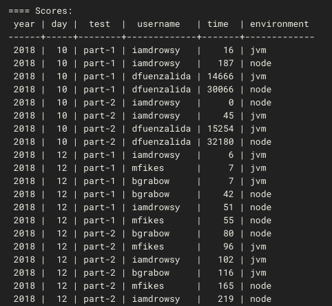

# Advent of CLJC

Cross platform Clojure Advent of Code solutions.

## Contribute

What's in it for you?
* Most of all, you will be encouraged to write portable Clojure code: a solution that runs on the JVM via Clojure and on Node via ClojureScript.
* Your Advent of Code solutions will be checked against the same input as others. This diminishes the possibility that your solution only works for your specific input.
* The performance of your solution can be compared with others via CircleCI (see [Scores](#scores)).

What's in it for the Clojure community?
* You are helping advance the [speculative](https://github.com/slipset/speculative) project, a collection of core specs.
* You are helping to build a large Clojure corpus for various purposes (see the Rationale for [coal-mine](https://github.com/mfikes/coal-mine)).

PRs welcome. Make a new solution file with the `new` script:

    script/new 2017 1 username

where `username` is your Github or Bitbucket username. Then fill in the solution in the file. If the input and answers are still empty you will have to provide it in `data.cljc`.

This repo will not accept multiple inputs and answers (see [this issue](https://github.com/borkdude/advent-of-cljc/issues/6) for details).

## Dev

Read [here](https://nrepl.xyz/nrepl/usage/server.html) how to get an nREPL for this project.

## Tests

Make sure the tests for your solution pass with the `test-one` script.

Please do not run calculations outside the tests. Memoized functions are permitted. Top-level lazy sequences are fine as long as they are not realized outside the tests.

CircleCI runs tests for changed namespaces with the `.circle/test-diff` script.

Tests support the following metadata:

 - `:skip-cljs`: used for skipping Node tests. Used in `.circle/test-diff`,
   `script/test` and `script/test-one`.
 - `:slow`: used for skipping long running tests. Only used in `script/test`.

Run all tests:

    script/test

Run one test:

    script/test-one 2017 1 username
    
Run with instrumentation:

    INSTRUMENT=true script/test
    INSTRUMENT=true script/test-one aoc.y2017.d01.username

Skip Clojure or ClojureScript:

    SKIP_CLJ=true script/test
    SKIP_CLJS=true script/test

## Scores

To view a time comparison of your solutions to others, go to
[CircleCI](https://circleci.com/gh/borkdude/advent-of-cljc/tree/master), open
"Test changed namespaces" and scroll to the end.

The entire list of scores can be viewed and downloaded in CSV format
[here](https://gist.github.com/borkdude/d7f42d4110e8a330d1d70f9242b14496).
